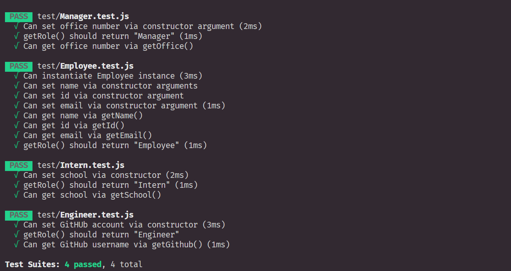
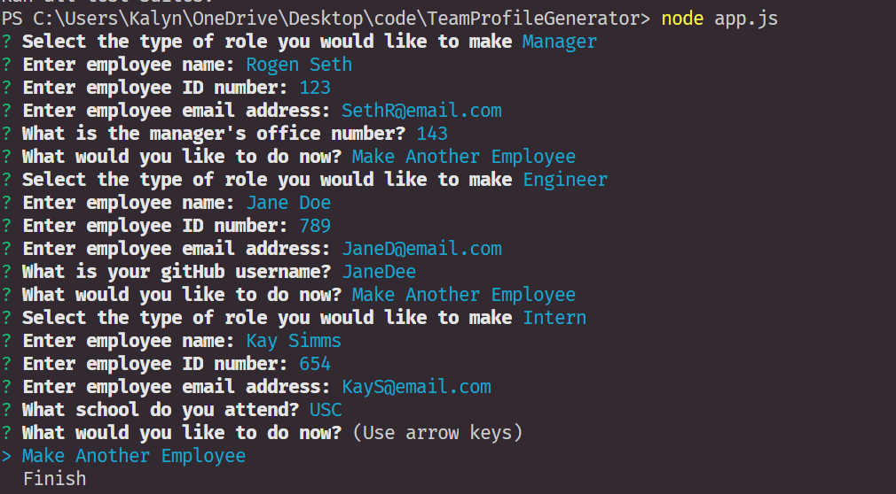
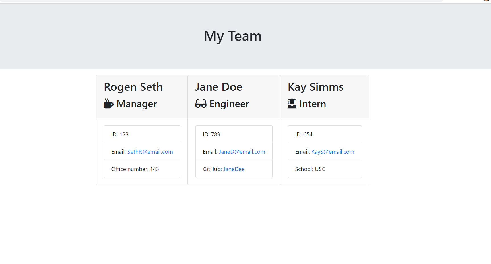

# Team Profile Generator

**Discription**
This application allows an user to create different employee role types based on their inputs answered within the console.After the inputs are selected an HTML page is generated displaying a team of employees. 

**Usage**
To use this application several npm packages need to be installed. Using the terminal type the command 'npm i' . This command will bring
 in the required packages to successfully run the program. Following the node installation, type the command 'node app.js' to execute the program. Once the program is executed, the console will then prompt the user to enter Employee Role Information for different Role 
 Types. You can create as many employees as you may like. Once all of the employees have been added to your team, select 'Finish'. The program will create  a 'index.html' page in the output folder with your Teams information.

 **Successful Testing**

 

  **Questions Examples**

 

 **Team Roster**
 
 

 
 